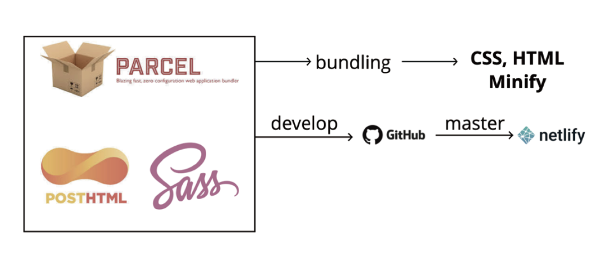

# Cafe-W

## Demo Video


## 소개

[Cafe-W](https://cafe-w.netlify.app): 패스트캠퍼스 FDS 18기 8조 프로젝트입니다. Cafe-W figma 시안을 바탕으로 진행한 클론 프로젝트이며, PostHTML, Sass, parcel을 사용하였고, Netlify를 이용하여 배포하였습니다.

## 코드 중복 작성을 최소화할 수 있는 PostHTML

- 팀원들 모두가 알고 있는 HTML 문법 그대로 활용이 가능하였음.
- 파일 단위로 각자 파트에 대한 코드를 작성하여 Git을 이용한 협업 시 충돌 방지에 도움이 되었음.
- 본인이 작업할 부분만 추출해서 코드를 작성하므로 가독성이 상승하였음.

## Netlify를 이용한 배포

- 동일한 소스에 대해 localhost 환경과 Netlify를 이용하여 호스팅한 페이지를 [lighthouse](https://developers.google.com/web/tools/lighthouse)를 이용하여 테스트 하였을 때 성능 부분에서 많은 차이가 발생
- SEO 관점에서 [다른 검사도구](https://novela-soft.com/seo-allcheck/)를 활용하여 `robots.txt`,`sitemap.xml`,`canonical tag` 등을 학습하고 적용할 수 있는 좋은 계기가 되었음.

## 이미지 최적화

- localhost 환경과 다르게 호스팅된 페이지에서 lighthouse 벤치마킹 결과 이미지를 불러오는 데 큰 부하가 발생하는 것을 확인.
- `.jpeg`,`.png` 및 svg 파일에 대한 최적화가 필요하다 판단하게 되었음.
- 자세한 사항은 [발표 자료](https://slides.com/baek2back/deck) 참조

## Accessibility

- 가급적 접근성을 고려하여 마크업을 진행하였으나 lighthouse 벤치마킹 결과 누락된 요소들이 존재하였음.
- 수정된 요소에 대한 사항은 [발표 자료](https://slides.com/baek2back/deck) 참조.

## Built With



## How to Run?

### localhost

```shell
$ cd src
$ npm start  # /build 폴더에 빌드된 결과물이 생성
```

### build

```shell
$ git merge develop # master 브랜치에 소스를 반영하면 Netlify에서 자동으로 실행함
$ npm run-script build # dist 폴더에 빌드된 결과물이 생성
```

## Team

- 김성백 [@baek2back](https://github.com/)
- 탁진호 [@sofreshian](https://github.com/sofreshian)
- 박재운 [@wisemett](https://github.com/wisemett)
